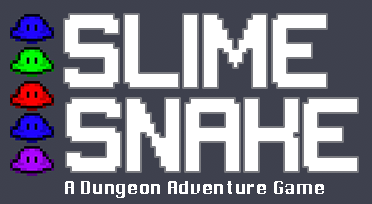
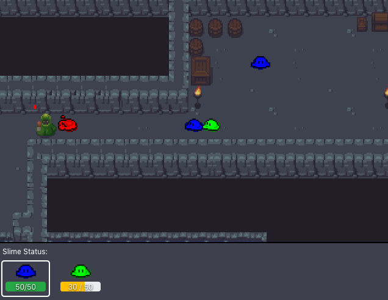
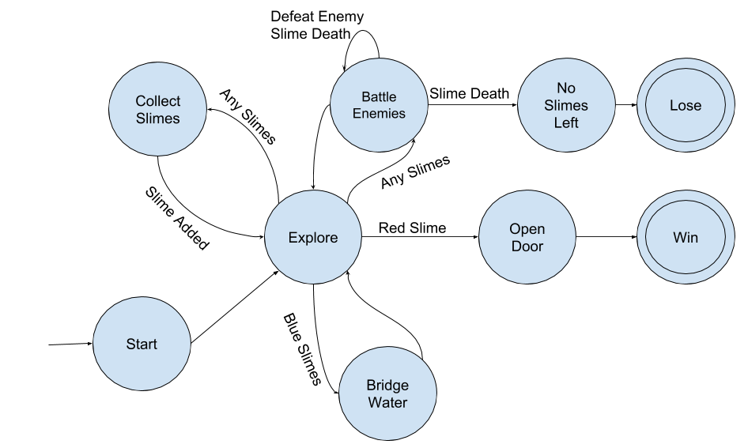

# CSCI 437 Game Development Final Project
### Designed and Developed by Kyle Peeler, Trent Spice, and Tim Hickam

## Live Demo:
[Play it here!](https://kylepeeler.io/slime-snake/)

## Screenshot:

This game is a puzzle dungeon crawler. The user must traverse a dungeon collecting allied slimes while navigating the 
dangers found within. These dangers range from treacherous streams (slimes hate water) to arcane wizards and barbarous
knights. The ultimate goal in each level is to reach the door at the end of the stage and break it down using the red
slime. However, the red slime isn't always out in the open. You will have to rely on all the slimes you can find to
navigate the bleak dungeon successfully.

### Requirements

You need [Node.js](https://nodejs.org) to install and run the game.

## User instructions

`cd` into the root directory of the game and run the following commands in your terminal:

| Command | Description |
|---------|-------------|
| `npm install` | Install dependencies and launch browser with examples.|
| `npm start` | Launch browser to show the game. By default it runs on [http://localhost:8000](http://localhost:8000)   Press `Ctrl + c` to kill **http-server** process. |

# Documentation

## Game Design Document
The scene is made up of a map created using the [Tiled map editor](https://www.mapeditor.org/) and [a tile set found on open game art](https://opengameart.org/content/dungeon-tileset). The scene should have a primary pathway with a few rooms along the way for the user to pick up slimes and encounter enemies. Generally, slimes and doors should be blocked by an enemy such that a user must fight and kill the enemy to proceed through the dungeon.

### Slimes
The user starts with one slime at the start at the game that they can use to move around the level. Other slimes are scattered around the map and the user can pick them up by colliding with them. Once they are picked up, they follow the head slime around the screen. The user can cycle between their slimes by using the a and d keys. The special ability, if it is not a damage increase, can be activated using the space bar, otherwise the space bar allows the slime to attack any colliding enemies. When you attack an enemy, the slime is damaged and the enemy is damaged. If the slime is destroyed, the next slime in line moves up to take its place. If the enemy is defeated, then the head slime still loses the damage, so it is possible for both the slime and the enemy to be defeated in one attack. All slimes start with 500 HP. Slimes can pass through each other so you do not need to worry about running into your own tail. The special ability of each slime is described below:

| Color | Ability |
|-|-|
| Red | Open doors (1 door to win level) |
| Blue | Bridge across water |
| Green | Deal more damage against wizards |
| Purple | Deal more damage against knights |

### Enemies
Enemies are spawned throughout the map with the intention of blocking the player from progressing through the dungeon until they are defeated. Their are two groups of enemies, wizards and knights. Wizard's take more damage from green slimes where as knight's take more damage from purple slimes, all other slimes deal normal amount of damage to each kind of enemy. The differences in enemies are described below:

| Color | Type | Ability |
|-|-|-|
| Red | Knight | Low HP |
| \* Silver | Knight | Medium / High HP |
| Red | Wizard | Low HP | 
| Green | Wizard | Medium HP | 
| \* Blue | Wizard | High HP |
\* = Not implemented in game level yet

### Layer names
These are the layers we used to form collisions and were generated by Tiled. We use these layers to enable and disable collisions when necessary based on the users interactions. The layer names are listed below:

| # | Name |
|-|-|
| 0 | ground |
| 1 | wall |
| 2 | water |
| 3 | door |
| 4 | objects |
| 5 | water |

### Point names
These are the point names we use to mark signficant points within Tiled when creating a map. Phaser is able to gather the x and y coordinates based on the names of the points so that we can spawn certain sprites in designated locations.

| # | Name |
|-|-|
| 0 | spawnpoint |
| 1 | slime-red |
| 2 | slime-blue |
| 3 | slime-green |
| 4 | slime-purple |
| 5 | knight-red |
| 6 | knight-silver |
| 7 | wizard-red |
| 8 | wizard-green |
| 9 | wizard-blue |
---

# Software Engineering Plan
## Team Member Responsibilities
* Kyle Peeler - Software Architect, UI Design/Implementation, Team Coordinator, Slime AI
* Trent Spice - Map Planning, Map Generation, Collision Management, SFX, Animations
* Tim Hickam - Integration, Combat, Slime Mechanics, Interactions

Team members were given tasks determined by consensus after finishing prior tasks. Considerations to past work was 
given when determining who would work on new tasks e.g. Trent was primarily given map-based tasks due to his 
familiarity with the map design tooling and implementation.

## Timeline

1. Plan mechanics for game
2. Implement working example using Phaser
3. ~~Implement TiledPhysics plugin example~~
4. Scrap TiledPhysics plugin dependency
5. Design Slime Follower mechanic
6. Add ability to pick up slimes
7. Procured sprite art for enemies and map
8. Generate basic map structure
9. Add ability to rotate slime positions without changing order
10. Removing slimes (no intended way for this to happen yet)
11. Spawn enemies based on map data
12. Implement combat
13. Add map interactions (bridge and final door)
14. Add UI for user to monitor slimes
15. Create health bars for enemies
16. Make beginning and end states for game based on win/lose/start
17. Add background music
18. Add various sound effects

# State Transition Diagram

# Attributions
* Original game idea - http://www.squidi.net/three/entry.php?id=185 
* Dungeon Tileset - https://opengameart.org/content/dungeon-tileset
* Slime Sprite Sheet - modified from https://gitlab.com/gedl/phaser-tiled-physics example
* Slime Health Bar UI elements - https://getbootstrap.com/
* Background music - https://soundcloud.com/cole_hearted/why-am-i-still-here
* Door sound - https://freesound.org/people/BenjaminNelan/sounds/321085/
* Water bridge sound - https://freesound.org/people/AGFX/sounds/20433/
* Slime swap sound - https://freesound.org/people/TheLukasBanana/sounds/417217/
* Wizard red attack sound - https://freesound.org/people/alonsotm/sounds/396500/
* Wizard green attack sound - https://freesound.org/people/suntemple/sounds/253176/
* Knight red attack sound - https://freesound.org/people/smokebomb99/sounds/147290/
* Slime attack sound - https://freesound.org/people/Zuzek06/sounds/353250/
* Slime pickup sound - https://freesound.org/people/DrMinky/sounds/167075/
